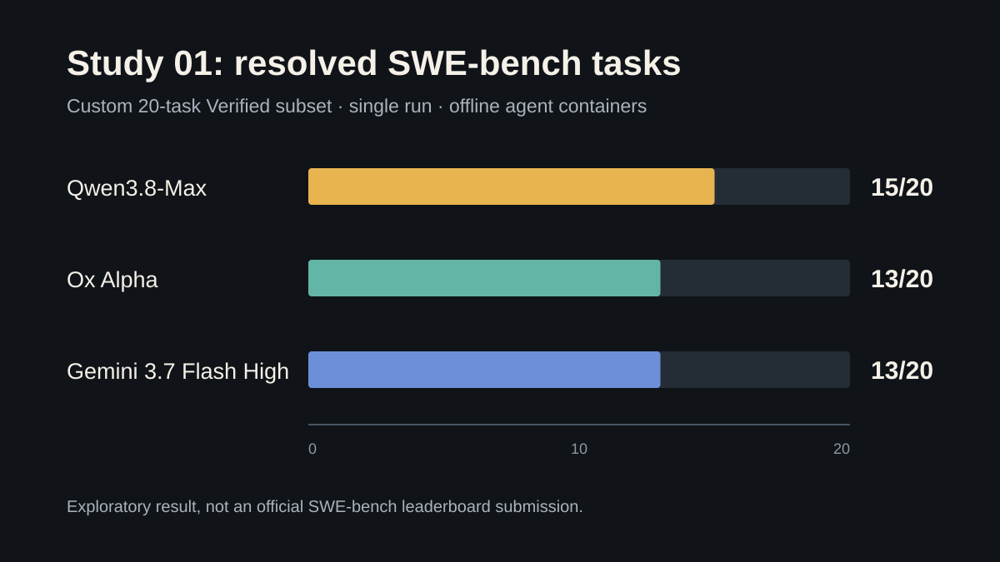

# Ox Alpha SWE-bench Studies

This repository documents a series of small SWE-bench experiments comparing Ox Alpha with coding models I can access. Each study freezes its task set, model routes, resource limits, predictions, and evaluator reports. New experiments are added as new studies rather than replacing earlier results.

The project began after Ox Alpha appeared as an unidentified model route on OpenRouter and OpenCode. Its early coding results attracted attention, so I wanted to test it myself instead of relying on anecdotal comparisons.



## Latest Study

Study 01 compares Ox Alpha, Gemini 3.7 Flash High, and Qwen3.8-Max on a deterministic 20-task subset of SWE-bench Verified. The models used the same mini-SWE-agent scaffold, and the agent containers had no external network access.

| Model | Resolved | Solve rate | API calls | Reported tokens |
|---|---:|---:|---:|---:|
| Qwen3.8-Max via Qoder AI | **15/20** | **75%** | 1,108 | 38.6M |
| Ox Alpha | **13/20** | **65%** | 662 | 13.8M |
| Gemini 3.7 Flash High | **13/20** | **65%** | 2,838 | 144.7M |

Qwen recorded the highest score on this task set. The difference is two tasks, and the sample is too small to establish a general model ranking. One task changes the reported rate by five percentage points; the 95% Wilson intervals overlap substantially.

- [Read the Study 01 report](studies/study-01/REPORT.md)
- [Inspect its task set](studies/study-01/taskset.md)
- [Inspect predictions](studies/study-01/predictions/)
- [Inspect evaluator reports](studies/study-01/evaluator-reports/)

## Study Index

| Study | Date | Tasks | Runs | Protocol | Observed result | Status |
|---|---|---:|---:|---|---|---|
| [Study 01](studies/study-01/REPORT.md) | 2026-08-24 | 20 | 1 | [`offline20-v1`](protocols/offline20-v1.md) | Qwen 15, Ox 13, Gemini 13 | Complete |

## Why The First Attempt Was Discarded

My first benchmark looked much better for Ox Alpha: it resolved 19 of 20 tasks, compared with 18 for Qwen and 11 for Gemini. I nearly treated that as the result.

An audit of all 60 trajectories showed that the agent containers had internet access. On some tasks, agents searched GitHub issues, pull requests, and exact upstream diffs. The three models used that access at different rates. The run measured an open-book workflow rather than the offline coding setup I thought I had tested, so I discarded its ranking and selected 20 new tasks for Study 01.

The failed attempt remains useful as a methodological lesson, but it is not included as a benchmark result in this repository.

## What Is Published

The repository contains the material needed to understand and recalculate Study 01:

- Frozen experiment manifest and task list
- Machine-readable summary
- Predictions for all three models
- Aggregate SWE-bench evaluator reports
- Evaluation policy
- Benchmark runner and regression tests
- Checksums for the published artifacts

Full trajectories and raw evaluator logs are not stored in Git. They contain hundreds of megabytes of repeated shell output and provider metadata. A sanitized archive can be attached to a study release later if independent trajectory inspection is needed.

## Reproduction

The runner is available in [`src/benchmark.py`](src/benchmark.py), with a shell entry point at [`src/run-benchmark.sh`](src/run-benchmark.sh). It expects Linux, Docker, and the packages pinned in [`requirements.txt`](requirements.txt).

```bash
python -m venv .venv
.venv/bin/pip install -r requirements.txt
export NINEROUTER_URL="http://your-gateway"
./src/run-benchmark.sh
```

The original project command was:

```bash
./run-benchmark.sh
```

Do not expect an exact score reproduction from mutable provider aliases. The repository preserves requested route IDs and provider response labels, but it cannot pin the remote model weights behind those routes.

## Limits Of The Latest Result

- Custom 20-task subset, not the full 500-task SWE-bench Verified set
- One run per model
- Public benchmark tasks may be present in model training data
- One shared agent scaffold
- Ox used mixed transport routing after five provider failures
- Provider token and cache accounting may not be directly comparable
- Provider-side model snapshots were not independently verifiable
- Two Pylint tasks produced the same advisory evaluator anomalies for all models

See [Study 01: Threats to validity](studies/study-01/REPORT.md#threats-to-validity) for details.

## Project Status

Study 01 is frozen. Corrections to prose or analysis will be recorded in the changelog, but its task set, predictions, evaluator reports, and scores will not be overwritten. A larger or repeated benchmark will be published as Study 02 under a new protocol version if the setup changes.

## Citation And License

Citation metadata is available in [`CITATION.cff`](CITATION.cff).

- Runner code: MIT License
- Original report text, tables, and analysis: CC BY 4.0
- SWE-bench tasks, generated patches, and upstream project material remain subject to their original terms

This is an independent personal project. It is not affiliated with SWE-bench, OpenCode, OpenRouter, Google, Qoder, Qwen, or the upstream repositories represented in the task set.
